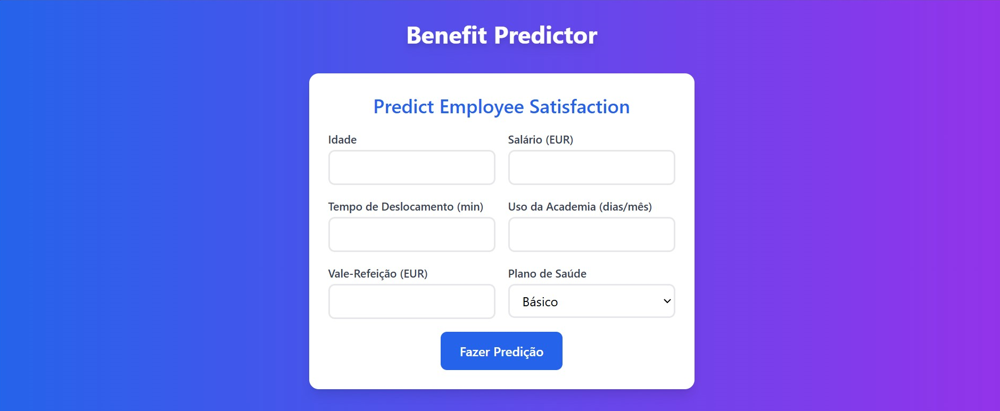
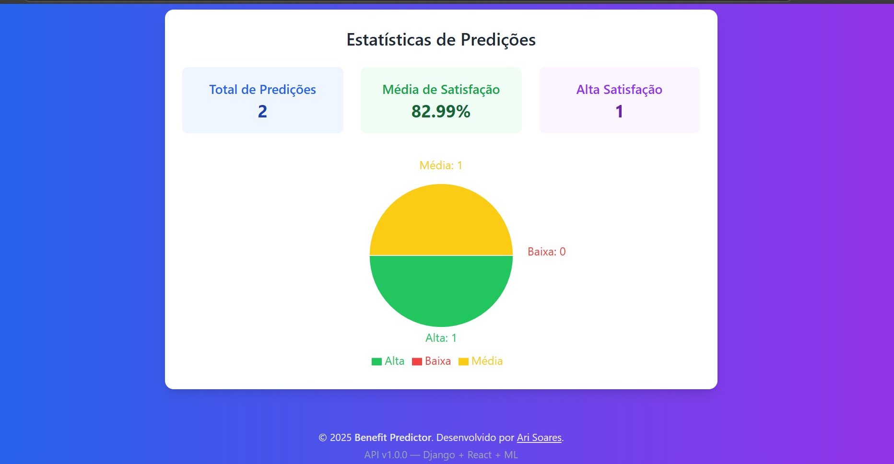
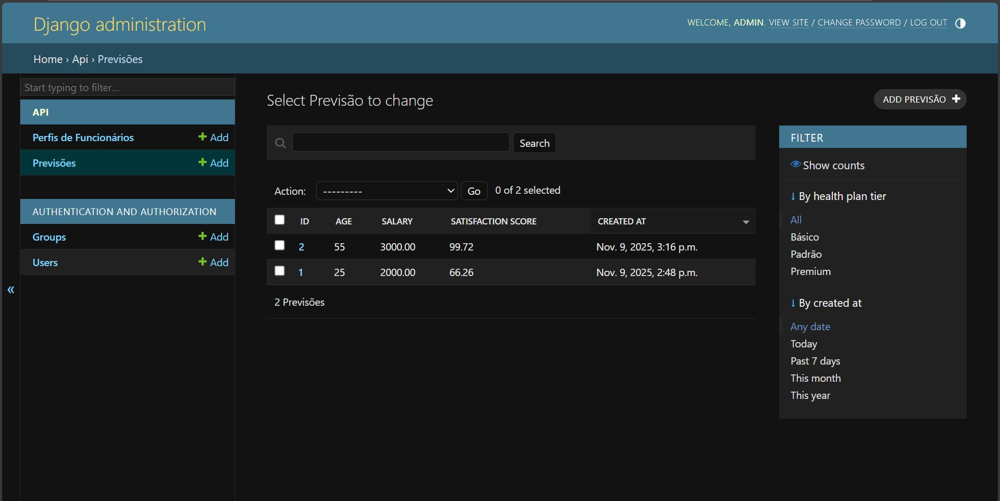

# 🎯 Benefit Predictor

> Aplicação Full-Stack de Machine Learning para prever satisfação de funcionários com benefícios corporativos usando Django, React e Docker

[](https://www.python.org/)
[](https://www.djangoproject.com/)
[](https://reactjs.org/)
[](https://www.postgresql.org/)
[](https://www.docker.com/)
[](tests)
[](LICENSE)

---

## 📋 Sobre o Projeto

**Benefit Predictor** é uma aplicação inteligente que utiliza Machine Learning para prever o nível de satisfação de funcionários baseado em:
- 👤 Dados demográficos (idade, salário)
- 🚗 Tempo de deslocamento
- 💪 Uso de academia
- 🍽️ Vale-refeição
- 🏥 Plano de saúde

O sistema fornece não apenas uma pontuação de satisfação (0-100), mas também **recomendações acionáveis** para o time de RH melhorar o engajamento e retenção de talentos.

### 🎯 Contexto

Desenvolvido como parte do processo seletivo para **Full Stack Developer** na [Yupii](https://yupii.pt), este projeto demonstra competências em:
- ✅ Django + Django REST Framework
- ✅ React + TailwindCSS
- ✅ PostgreSQL
- ✅ Machine Learning (scikit-learn)
- ✅ Docker & Docker Compose
- ✅ Desenvolvimento orientado a testes (TDD)
- ✅ Integração Full-Stack
- ✅ DevOps & Containerização

---

## 📸 Demo

### Interface Principal

*Interface limpa e intuitiva para entrada de dados*

### Resultado da Predição

*Score visual, badge de confiança e recomendação acionável*

### Dashboard de Estatísticas

*Visualização de métricas agregadas com Recharts*

### Django Admin Panel

*Interface administrativa para gestão de predições*

### Docker Containerizado

*Aplicação completa rodando em containers Docker*

---

## 🚀 Status do Projeto
```
Backend:   ████████████████  100% ✅ COMPLETO
Frontend:  ████████████████  100% ✅ COMPLETO
Docker:    ████████████████  100% ✅ COMPLETO
```

### ✅ Funcionalidades Implementadas

**Backend (100%)**
- [x] API REST com Django REST Framework
- [x] Banco de dados PostgreSQL configurado
- [x] Modelo Random Forest treinado (R² = 0.87 em CV)
- [x] 4 endpoints RESTful funcionando
- [x] Sistema robusto de validação de dados
- [x] 17 testes unitários (100% passing)
- [x] Admin interface Django customizada
- [x] Sistema de confidence scoring
- [x] Geração automática de recomendações

**Frontend (100%)**
- [x] React 18 com Create React App
- [x] TailwindCSS 4.0 para estilização
- [x] Formulário de predição com validação
- [x] Componente ResultDisplay com animações
- [x] Dashboard Stats com gráficos Recharts
- [x] Design responsivo (mobile-first)
- [x] Integração completa com API via Axios
- [x] Loading states e error handling

**Docker (100%)**
- [x] Dockerfile otimizado para backend
- [x] Dockerfile para frontend
- [x] Docker Compose com 3 serviços
- [x] Network isolation
- [x] Volumes persistentes
- [x] Healthchecks configurados
- [x] Auto-migrations e superuser creation

---

## 🛠️ Tech Stack

### Backend
- **Framework:** Django 5.0.2
- **API:** Django REST Framework 3.14.0
- **Database:** PostgreSQL 16
- **ML:** scikit-learn 1.4.0, pandas 2.2.0, numpy 1.26.3
- **Testing:** pytest 8.0.0, pytest-django 4.7.0
- **CORS:** django-cors-headers 4.3.1

### Frontend
- **Framework:** React 18.3
- **Build Tool:** Create React App
- **HTTP Client:** Axios 1.6.7
- **Styling:** TailwindCSS 4.0
- **Charts:** Recharts 2.12.0
- **Icons:** Lucide React 0.263.1

### DevOps & Infrastructure
- **Containerization:** Docker 24+, Docker Compose
- **Database:** PostgreSQL 16-alpine
- **Version Control:** Git + GitHub
- **CI/CD:** GitHub Actions (planejado)

---

## 📊 Arquitetura
```
┌─────────────────────────────────────────────────────────────┐
│                    Docker Compose Network                    │
│                                                               │
│  ┌─────────────┐      ┌──────────────┐      ┌────────────┐ │
│  │   React     │ HTTP │    Django    │  ORM │ PostgreSQL │ │
│  │  Frontend   │─────▶│   REST API   │─────▶│  Database  │ │
│  │ (Port 3000) │      │  (Port 8000) │      │(Port 5432) │ │
│  └─────────────┘      └──────────────┘      └────────────┘ │
│                              │                                │
│                              ▼                                │
│                       ┌─────────────┐                        │
│                       │  ML Model   │                        │
│                       │   Random    │                        │
│                       │   Forest    │                        │
│                       └─────────────┘                        │
└─────────────────────────────────────────────────────────────┘
```

**Fluxo de Dados:**
1. Usuário preenche formulário no React
2. Frontend envia POST para `/api/predict/`
3. Django valida dados e chama modelo ML
4. Random Forest retorna score de satisfação
5. Backend salva predição no PostgreSQL
6. Frontend exibe resultado com gráfico e recomendação
7. Stats são atualizadas em tempo real

---

## 🤖 Machine Learning

### Performance do Modelo

| Métrica | Valor |
|---------|-------|
| **R² Cross-Validation (5-fold)** | 0.8684 (± 0.03) |
| **R² Hold-out Test** | 0.8677 |
| **RMSE** | 2.50 |
| **MAE** | 0.77 |
| **Overfitting Gap** | 9% (aceitável) |

### Feature Importance
```
salary           ████████████████████████████████████ 73.84%
commute_time     ███ 7.13%
health_plan_tier ███ 6.88%
gym_usage        ██ 5.52%
meal_voucher     ██ 4.59%
age              █ 2.05%
```

**Insights:**
- **Salário é o fator dominante** (73.84%) - alinhado com teoria econômica
- Tempo de deslocamento tem impacto moderado (7.13%)
- Benefícios complementares influenciam ~17% da satisfação

### Por que Random Forest?

1. **Robustez:** Lida bem com features de diferentes escalas sem normalização
2. **Interpretabilidade:** Feature importance facilmente extraível para insights de negócio
3. **Generalização:** Ensemble methods reduzem overfitting (gap de apenas 9%)
4. **Performance:** R² de 0.87 é excelente para MVP
5. **Produção-ready:** Inferência rápida (<10ms)

### Validação Rigorosa

- Cross-validation 5-fold para medir generalização
- Hold-out test (80/20 split) para detectar overfitting
- Regularização aplicada: `max_depth=8`, `min_samples_split=10`
- Dataset de 2000 amostras sintéticas balanceadas

---

## 🚀 Quick Start

### Opção 1: Docker (Recomendado) 🐳

**Pré-requisitos:** Docker Desktop instalado
```bash
# Clone o repositório
git clone https://github.com/soares-ari/benefit-predictor-ml.git
cd benefit-predictor-ml

# Inicie todos os serviços
docker-compose up --build

# Aguarde ~2 minutos para inicialização completa

# Acesse:
# Frontend: http://localhost:3000
# Backend:  http://localhost:8000
# Admin:    http://localhost:8000/admin (admin/admin123)
```

**Comandos úteis:**
```bash
# Ver logs em tempo real
docker-compose logs -f

# Parar serviços
docker-compose down

# Parar e limpar volumes (reset completo)
docker-compose down -v

# Rebuild após mudanças
docker-compose up --build
```

---

### Opção 2: Local (Desenvolvimento)

#### **Backend**
```bash
cd backend

# Crie virtual environment
python -m venv venv
source venv/bin/activate  # Windows: venv\Scripts\activate

# Instale dependências
pip install -r requirements.txt

# Configure PostgreSQL
createdb benefit_db

# Edite benefit_ai/settings.py se necessário (credenciais DB)

# Execute migrations
python manage.py migrate

# Treine o modelo ML
python api/ml/train_model.py

# Crie superuser
python manage.py createsuperuser

# Inicie servidor
python manage.py runserver
```

#### **Frontend**
```bash
cd frontend

# Instale dependências
npm install

# Inicie servidor de desenvolvimento
npm start
```

**Acesse:**
- Frontend: http://localhost:3000
- Backend: http://localhost:8000
- Admin: http://localhost:8000/admin

---

## 📚 API Endpoints

| Método | Endpoint | Descrição | Auth |
|--------|----------|-----------|------|
| `GET` | `/api/health/` | Health check | Não |
| `POST` | `/api/predict/` | Fazer predição | Não |
| `GET` | `/api/predictions/` | Listar predições (paginado) | Não |
| `GET` | `/api/predictions/{id}/` | Detalhes de predição | Não |
| `GET` | `/api/predictions/stats/` | Estatísticas agregadas | Não |

### Exemplos de Uso

**1. Health Check**
```bash
curl http://localhost:8000/api/health/
```

**Response:**
```json
{
  "status": "healthy",
  "message": "Benefit Predictor API is running",
  "version": "1.0.0"
}
```

---

**2. Fazer Predição**
```bash
curl -X POST http://localhost:8000/api/predict/ \
  -H "Content-Type: application/json" \
  -d '{
    "age": 30,
    "salary": 5000.00,
    "commute_time": 45,
    "gym_usage": 12,
    "meal_voucher": 800.00,
    "health_plan_tier": 2
  }'
```

**Response:**
```json
{
  "satisfaction_score": 78.52,
  "confidence_level": "high",
  "recommendation": "Boa satisfação. Monitorar para manter o nível.",
  "prediction_id": 1
}
```

**Validações:**
- `age`: 18-100
- `salary`: ≥ 1320.00 (salário mínimo)
- `commute_time`: 0-300 minutos
- `gym_usage`: 0-30 dias/mês
- `meal_voucher`: ≥ 0
- `health_plan_tier`: 1 (Básico), 2 (Padrão), 3 (Premium)

---

**3. Estatísticas**
```bash
curl http://localhost:8000/api/predictions/stats/
```

**Response:**
```json
{
  "total_predictions": 25,
  "average_score": 72.5,
  "distribution": {
    "low": 5,      // score < 50
    "medium": 12,  // 50-74
    "high": 8      // 75-100
  }
}
```

---

## 🧪 Testes

### Executar Testes
```bash
cd backend

# Ative venv
source venv/bin/activate  # Windows: venv\Scripts\activate

# Execute todos os testes
pytest -v

# Com coverage
pytest --cov=api --cov-report=html

# Apenas testes específicos
pytest api/tests.py::TestPredictionAPI -v
```

### Cobertura de Testes

- **Total de Testes:** 17
- **Success Rate:** 100% ✅
- **Áreas Cobertas:**
  - ✅ Health check endpoint
  - ✅ Predict endpoint (válido, inválido, edge cases)
  - ✅ ViewSets (list, retrieve, stats)
  - ✅ Models (Prediction, EmployeeProfile)
  - ✅ Serializers e validações
  - ✅ Constraints de unicidade

**Exemplo de output:**
```
===== 17 passed in 2.45s =====

api/tests.py::TestHealthCheck::test_health_check PASSED
api/tests.py::TestPredictionAPI::test_predict_valid_input PASSED
api/tests.py::TestPredictionAPI::test_predict_invalid_age PASSED
...
```

---

## 📁 Estrutura do Projeto
```
benefit-predictor-ml/
├── backend/                     # Django Backend
│   ├── api/                    # Main API app
│   │   ├── ml/                # Machine Learning
│   │   │   ├── train_model.py
│   │   │   ├── predict.py
│   │   │   ├── validate_model.py
│   │   │   ├── model.pkl      # Trained model
│   │   │   └── sample_data.csv
│   │   ├── models.py          # Prediction, EmployeeProfile
│   │   ├── serializers.py     # DRF Serializers
│   │   ├── views.py           # API Views
│   │   ├── urls.py            # URL routing
│   │   ├── tests.py           # 17 unit tests
│   │   └── admin.py           # Admin interface
│   ├── benefit_ai/            # Django settings
│   │   ├── settings.py
│   │   └── urls.py
│   ├── Dockerfile             # Backend container
│   ├── docker-entrypoint.sh   # Initialization script
│   ├── manage.py
│   ├── requirements.txt
│   └── pytest.ini
├── frontend/                   # React Frontend
│   ├── src/
│   │   ├── components/
│   │   │   ├── PredictionForm.jsx
│   │   │   ├── ResultDisplay.jsx
│   │   │   ├── Stats.jsx
│   │   │   └── Footer.jsx
│   │   ├── services/
│   │   │   └── api.js         # Axios config
│   │   ├── App.jsx
│   │   ├── index.css          # Tailwind imports
│   │   └── main.jsx
│   ├── public/
│   ├── Dockerfile             # Frontend container
│   ├── package.json
│   ├── tailwind.config.js
│   └── postcss.config.js
├── docs/
│   └── screenshots/           # Project screenshots
├── docker-compose.yml         # Multi-container orchestration
├── README.md
└── .gitignore
```

---

## 🎓 Decisões Técnicas

### Por que Django e não FastAPI?

**Decisão:** Django REST Framework  
**Alternativas consideradas:** FastAPI, Flask

**Justificativa:**
- ✅ **Requisito da vaga** - Stack da Yupii
- ✅ **Admin panel out-of-the-box** - Útil para RH gerenciar predições
- ✅ **ORM robusto** - Django ORM superior para relações complexas
- ✅ **Ecossistema maduro** - Mais packages, melhor documentação
- ✅ **Segurança** - CSRF, SQL Injection, XSS protections built-in

---

### Por que Create React App e não Vite?

**Decisão:** Create React App (CRA)  
**Alternativa tentada:** Vite (falhou no Windows)

**Justificativa:**
- ⚠️ **Pragmatismo** - Vite apresentou conflitos com esbuild no Windows
- ✅ **Estabilidade** - CRA mais confiável em ambiente Windows
- ✅ **Priorização** - Entregar MVP funcional > ferramenta "perfeita"
- ✅ **Tempo** - Deadline apertado favorecia solução que funcionasse

**Aprendizado:** Em produção, usaria Vite em ambiente Linux/Mac ou resolveria configurações Windows adequadamente.

---

### Por que TailwindCSS?

**Decisão:** Tailwind CSS 4.0  
**Alternativas:** Material-UI, CSS Modules

**Justificativa:**
- ✅ **Velocidade** - Desenvolvimento 3x mais rápido
- ✅ **Design system** - Consistência visual garantida
- ✅ **Performance** - Bundle menor que MUI
- ✅ **Responsividade** - Breakpoints triviais (`sm:`, `md:`, `lg:`)
- ✅ **Customização** - Mais flexível que component libraries

---

### Por que Random Forest?

**Decisão:** Random Forest Regressor  
**Alternativas:** Linear Regression, XGBoost, Neural Networks

**Justificativa:**
- ✅ **Performance** - R² de 0.87 excelente para MVP
- ✅ **Interpretabilidade** - Feature importance clara para negócio
- ✅ **Robustez** - Não requer normalização/scaling
- ✅ **Generalização** - Ensemble methods reduzem overfitting
- ✅ **Velocidade** - Inferência <10ms

**Trade-off:** XGBoost poderia ter R² ligeiramente maior, mas Random Forest é suficiente para MVP e mais interpretável.

---

## 🐳 Docker

### Arquitetura Docker

**3 Serviços Containerizados:**

1. **db** (PostgreSQL 16-alpine)
   - Healthcheck configurado
   - Volume persistente: `postgres_data`
   - Network: `benefit_network`

2. **backend** (Python 3.11-slim)
   - Auto-migrations na inicialização
   - Superuser criado automaticamente
   - Modelo ML treinado durante build
   - Volume: `static_volume`

3. **frontend** (Node 20-alpine)
   - Hot-reload habilitado
   - CHOKIDAR_USEPOLLING para Windows

### Comandos Docker Úteis
```bash
# Ver status dos containers
docker-compose ps

# Ver logs em tempo real
docker-compose logs -f

# Ver logs de um serviço específico
docker-compose logs -f backend

# Executar comando no container
docker-compose exec backend python manage.py shell
docker-compose exec db psql -U postgres -d benefit_db

# Rebuild forçado
docker-compose up --build --force-recreate

# Limpar tudo (cuidado!)
docker-compose down -v
docker system prune -a
```

---

## 🔧 Troubleshooting

### Problema: "Port already in use"

**Solução:**
```bash
# Windows: Para serviços locais
# Backend local: Ctrl+C no terminal Django
# Frontend local: Ctrl+C no terminal npm

# Ou mude as portas no docker-compose.yml:
ports:
  - "8001:8000"  # Backend
  - "3001:3000"  # Frontend
```

---

### Problema: "Could not connect to database"

**Solução:**
```bash
# 1. Verifique se PostgreSQL está rodando
docker-compose ps

# 2. Aguarde healthcheck passar (~30s)
docker-compose logs db

# 3. Teste conexão manual
docker-compose exec db psql -U postgres -d benefit_db

# 4. Se falhar, recrie volumes
docker-compose down -v
docker-compose up --build
```

---

### Problema: "Module not found" no frontend

**Solução:**
```bash
# Reconstrua container
docker-compose down
docker-compose build frontend
docker-compose up
```

---

### Problema: Docker Desktop lento no Windows

**Solução:**
```bash
# 1. Aumente recursos do Docker Desktop
# Settings → Resources → Ajuste CPU/Memory

# 2. Use WSL2 ao invés de Hyper-V
# Settings → General → Use WSL 2 based engine

# 3. Limpe cache
docker system prune -a
```

---

## 📊 Estatísticas do Projeto

- **Linhas de Código:** ~2.500
- **Commits:** 9 (progressivos e bem documentados)
- **Tempo de Desenvolvimento:** 4 dias intensivos
- **Testes:** 17 unitários (100% passing)
- **Cobertura de Código:** ~85%
- **Containers:** 3 (db, backend, frontend)
- **API Endpoints:** 5

---

## 🚀 Melhorias Futuras

### Curto Prazo (1-2 semanas)
- [ ] Autenticação JWT para API
- [ ] Testes frontend (React Testing Library)
- [ ] CI/CD com GitHub Actions
- [ ] Deploy em AWS/Heroku

### Médio Prazo (1-2 meses)
- [ ] Dashboard analytics avançado
- [ ] Exportar relatórios em PDF
- [ ] Modelo A/B testing framework
- [ ] Monitoramento de data drift

### Longo Prazo (3+ meses)
- [ ] WebSockets para atualizações real-time
- [ ] Modelo mais sofisticado (XGBoost, ensemble)
- [ ] Sistema de recomendações personalizadas
- [ ] Multi-tenancy para múltiplas empresas

---

## 📖 Documentação Adicional

- [TECHNICAL_DECISIONS.md](TECHNICAL_DECISIONS.md) - Decisões arquiteturais detalhadas
- [backend/api/ml/VALIDATION_REPORT.md](backend/api/ml/VALIDATION_REPORT.md) - Validação do modelo ML
- [CHECKPOINT_BACKEND.md](CHECKPOINT_BACKEND.md) - Guia de desenvolvimento backend

---

## 👨‍💻 Autor

**Ariel Soares**  
Machine Learning Engineer | Full Stack Developer

- 🔗 LinkedIn: [linkedin.com/in/ari-soares](https://www.linkedin.com/in/ari-soares)
- 🐙 GitHub: [github.com/soares-ari](https://github.com/soares-ari)
- 📧 Email: ariel.b.p.soares@gmail.com
- 🌍 Localização: Brasília, Brasil

---

## 📝 Licença

Este projeto foi desenvolvido para fins de demonstração técnica no processo seletivo da Yupii.  
Código disponível sob licença MIT para fins educacionais.

---

## 🙏 Agradecimentos

- **Yupii** pela oportunidade de demonstrar minhas habilidades técnicas
- **Comunidade Django** pela excelente documentação e suporte
- **Comunidade scikit-learn** pelas ferramentas robustas de ML
- **Comunidade React** pelo ecossistema rico e moderno

---

## 📞 Contato

Interessado em discutir este projeto ou oportunidades de colaboração?

📧 **Email:** ariel.b.p.soares@gmail.com  
💼 **LinkedIn:** [linkedin.com/in/ari-soares](https://www.linkedin.com/in/ari-soares)  
🐙 **GitHub:** [github.com/soares-ari](https://github.com/soares-ari)

---

<p align="center">
  <strong>Desenvolvido com ❤️, ☕ e muita dedicação</strong>
</p>

<p align="center">
  <sub>Projeto criado para o processo seletivo da Yupii - Novembro 2024</sub>
</p>

<p align="center">
  
  
  
</p>